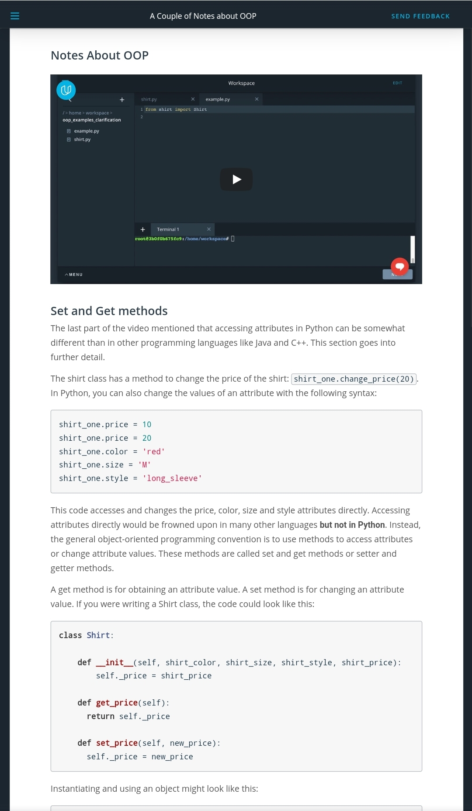
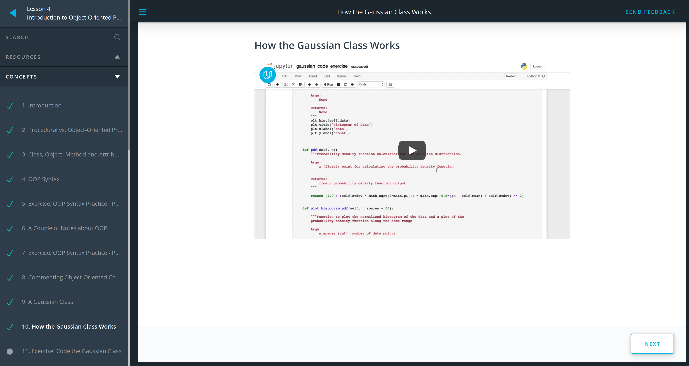
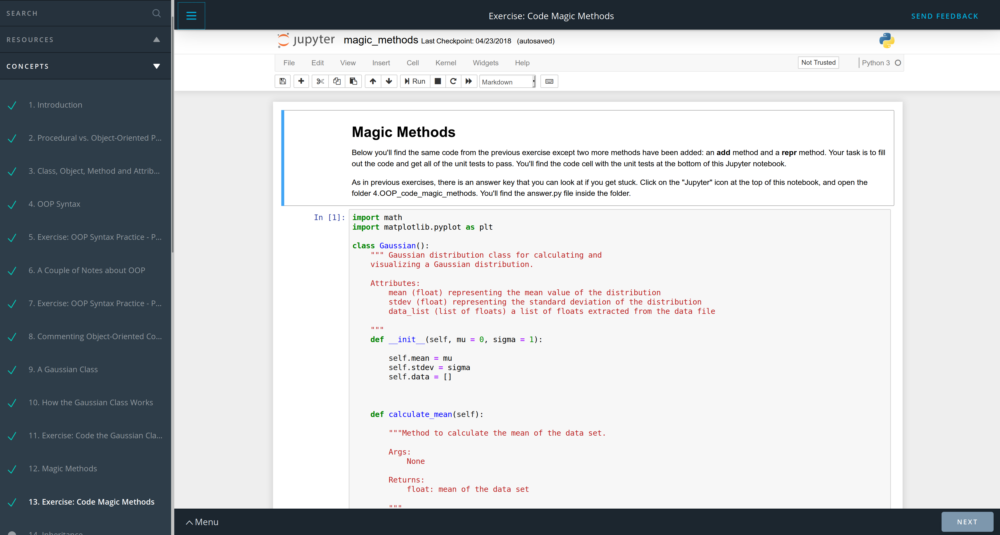
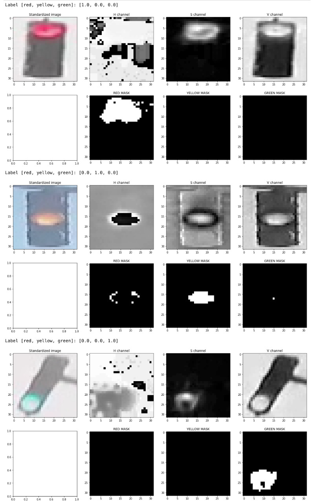
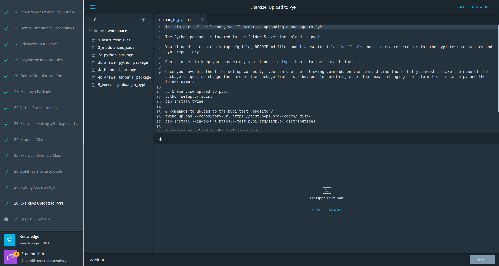
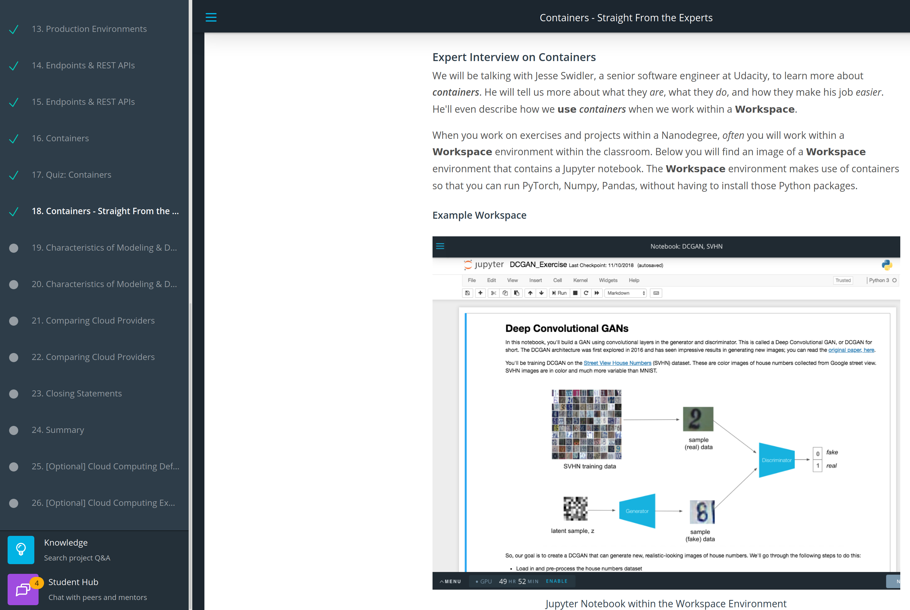
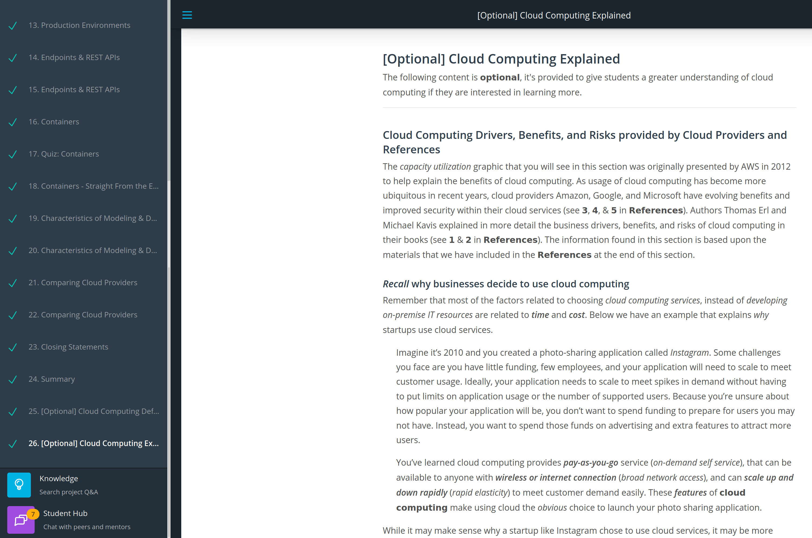

# 3-months-of-machine-learning-engineer

# My pledge "3 months of Udacity" for the Machine Learning Engineer nanodegree, the AWS DeepRacer scholarship I won.

## Day 1: November 19, 2019 #30DaysofUdacity #PracticeMakesPerfect

- I started the Machine Learning Engineer nanodegree.
- I read the **Syllabus: Machine Learning Engineer Nanodegree Program**.
- My current progress is:\
  **Part 1: Software Engineering Fundamentals** (Progress 22%)\
  **Lesson 2: Software Engineering Practices Pt I** (Progress 48%)\
  **12. Solution: Optimizing - Common Books**
- I encourage @KhushkumarP, @Jacqueline SusanM, @labibaR, @OudarjyaS, @MuhammadN, @Mohamed ChoukriB, @KonstantinosK, @AdityaK, @MahmmoudM, @LauraT, @ElenaK, @HelenaB, @RobO, @ShafaqA, @Nancy A, @TzuhsinC, @TemitopeO, @AarthiA, @NabhanA, @MD BAPPIP, @AnkitV, @fuzhanR, @Laszlo TothL. 

## Day 2: November 20, 2019 #30DaysofUdacity #PracticeMakesPerfect

- I'm watching the video lectures and programming the Jupyter notebooks.
- My current progress is:\
  **Part 1: Software Engineering Fundamentals** (Progress 48%)\
  **Lesson 3: Software Engineering Practices Pt II** (Progress 50%)\
  **7. Test Driven Development and Data Science**
- I encourage @KhushkumarP, @Jacqueline SusanM, @labibaR, @OudarjyaS, @MuhammadN, @Mohamed ChoukriB, @KonstantinosK, @AdityaK, @MahmmoudM, @LauraT, @ElenaK, @HelenaB, @RobO, @ShafaqA, @Nancy A, @TzuhsinC, @TemitopeO, @AarthiA, @NabhanA, @MD BAPPIP, @AnkitV, @fuzhanR, @Laszlo TothL. 

## Day 3: November 21, 2019 #30DaysofUdacity #PracticeMakesPerfect

- I'm watching the video lectures and programming the Jupyter notebooks.
- My current progress is:\
  **Part 1: Software Engineering Fundamentals** (Progress 52%)\
  **Lesson 3: Software Engineering Practices Pt II** (Progress 71%)\
  **10. Quiz: Logging**
- I encourage @KhushkumarP, @Jacqueline SusanM, @labibaR, @OudarjyaS, @MuhammadN, @Mohamed ChoukriB, @KonstantinosK, @AdityaK, @MahmmoudM, @LauraT, @ElenaK, @HelenaB, @RobO, @ShafaqA, @Nancy A, @TzuhsinC, @TemitopeO, @AarthiA, @NabhanA, @MD BAPPIP, @AnkitV, @fuzhanR, @Laszlo TothL. 

## Day 4: November 22, 2019 #30DaysofUdacity #PracticeMakesPerfect

- I'm watching the video lectures and programming the Jupyter notebooks.
- My current progress is:\
  **Part 1: Software Engineering Fundamentals** (Progress 55%)\
  **Lesson 3: Software Engineering Practices Pt II** (Progress 86%)\
  **12. Questions to Ask Yourself When Conducting a Code Review**
- I encourage @KhushkumarP, @Jacqueline SusanM, @labibaR, @OudarjyaS, @MuhammadN, @Mohamed ChoukriB, @KonstantinosK, @AdityaK, @MahmmoudM, @LauraT, @ElenaK, @HelenaB, @RobO, @ShafaqA, @Nancy A, @TzuhsinC, @TemitopeO, @AarthiA, @NabhanA, @MD BAPPIP, @AnkitV, @fuzhanR, @Laszlo TothL. 

## Day 5: November 23, 2019 #30DaysofUdacity #PracticeMakesPerfect

- I'm watching the video lectures and programming the Jupyter notebooks.
- I finished the following section:\
  **Part 1: Software Engineering Fundamentals**\
  **Lesson 3: Software Engineering Practices Pt II**
- I encourage @KhushkumarP, @Jacqueline SusanM, @labibaR, @OudarjyaS, @MuhammadN, @Mohamed ChoukriB, @KonstantinosK, @AdityaK, @MahmmoudM, @LauraT, @ElenaK, @HelenaB, @RobO, @ShafaqA, @Nancy A, @TzuhsinC, @TemitopeO, @AarthiA, @NabhanA, @MD BAPPIP, @AnkitV, @fuzhanR, @Laszlo TothL. 

## Day 6: November 24, 2019 #30DaysofUdacity #PracticeMakesPerfect

- I'm watching the video lectures and programming the Jupyter notebooks.
- My current progress is:\
  **Part 1: Software Engineering Fundamentals** (Progress 63%)\
  **Lesson 4: Introduction to Object-Oriented Programming** (Progress 14%)\
  **4. OOP Syntax**
- I encourage @KhushkumarP, @Jacqueline SusanM, @labibaR, @OudarjyaS, @MuhammadN, @Mohamed ChoukriB, @KonstantinosK, @AdityaK, @MahmmoudM, @LauraT, @ElenaK, @HelenaB, @RobO, @ShafaqA, @Nancy A, @TzuhsinC, @TemitopeO, @AarthiA, @NabhanA, @MD BAPPIP, @AnkitV, @fuzhanR, @Laszlo TothL. 

## Day 7: November 25, 2019 #30DaysofUdacity #PracticeMakesPerfect

- I'm watching the video lectures and programming the Jupyter notebooks.
- My current lecture is:\
  **Part 1: Software Engineering Fundamentals**\
  **Lesson 4: Introduction to Object-Oriented Programming**\
  **5. Exercise: OOP Syntax Practice - Part 1**
- I encourage @KhushkumarP, @Jacqueline SusanM, @labibaR, @OudarjyaS, @MuhammadN, @Mohamed ChoukriB, @KonstantinosK, @AdityaK, @MahmmoudM, @LauraT, @ElenaK, @HelenaB, @RobO, @ShafaqA, @Nancy A, @TzuhsinC, @TemitopeO, @AarthiA, @NabhanA, @MD BAPPIP, @AnkitV, @fuzhanR, @Laszlo TothL. 

## Day 8: November 26, 2019 #30DaysofUdacity #PracticeMakesPerfect

- I'm watching the video lectures and programming the Jupyter notebooks.
- My current lecture is:\
  **Part 1: Software Engineering Fundamentals**\
  **Lesson 4: Introduction to Object-Oriented Programming**\
  **6. A Couple of Notes about OOP**
- I encourage @KhushkumarP, @Jacqueline SusanM, @labibaR, @OudarjyaS, @MuhammadN, @Mohamed ChoukriB, @KonstantinosK, @AdityaK, @MahmmoudM, @LauraT, @ElenaK, @HelenaB, @RobO, @ShafaqA, @Nancy A, @TzuhsinC, @TemitopeO, @AarthiA, @NabhanA, @MD BAPPIP, @AnkitV, @fuzhanR, @Laszlo TothL. 

## Day 9: November 27, 2019 #30DaysofUdacity #PracticeMakesPerfect

- I'm watching the video lectures and programming the Jupyter notebooks.
- My current lecture is:\
  **Part 1: Software Engineering Fundamentals**\
  **Lesson 4: Introduction to Object-Oriented Programming**\
  **7. Exercise: OOP Syntax Practice - Part 2**
- I encourage @KhushkumarP, @Jacqueline SusanM, @labibaR, @OudarjyaS, @MuhammadN, @Mohamed ChoukriB, @KonstantinosK, @AdityaK, @MahmmoudM, @LauraT, @ElenaK, @HelenaB, @RobO, @ShafaqA, @Nancy A, @TzuhsinC, @TemitopeO, @AarthiA, @NabhanA, @MD BAPPIP, @AnkitV, @fuzhanR, @Laszlo TothL. 

## Day 10: November 28, 2019 #30DaysofUdacity #PracticeMakesPerfect

- I'm watching the video lectures and programming the Jupyter notebooks.
- My current lecture is:\
  **Part 1: Software Engineering Fundamentals**\
  **Lesson 4: Introduction to Object-Oriented Programming**\
  **8. Commenting Object-Oriented Code**
- I encourage @KhushkumarP, @Jacqueline SusanM, @labibaR, @OudarjyaS, @MuhammadN, @Mohamed ChoukriB, @KonstantinosK, @AdityaK, @MahmmoudM, @LauraT, @ElenaK, @HelenaB, @RobO, @ShafaqA, @Nancy A, @TzuhsinC, @TemitopeO, @AarthiA, @NabhanA, @MD BAPPIP, @AnkitV, @fuzhanR, @Laszlo TothL. 

## Day 11: November 29, 2019 #30DaysofUdacity #PracticeMakesPerfect

- I'm watching the video lectures and programming the Jupyter notebooks.
- My current lecture is:\
  **Part 1: Software Engineering Fundamentals**\
  **Lesson 4: Introduction to Object-Oriented Programming**\
  **9. A Gaussian Class**
- I encourage @KhushkumarP, @Jacqueline SusanM, @labibaR, @OudarjyaS, @MuhammadN, @Mohamed ChoukriB, @KonstantinosK, @AdityaK, @MahmmoudM, @LauraT, @ElenaK, @HelenaB, @RobO, @ShafaqA, @Nancy A, @TzuhsinC, @TemitopeO, @AarthiA, @NabhanA, @MD BAPPIP, @AnkitV, @fuzhanR, @Laszlo TothL. 

## Day 12: November 30, 2019 #30DaysofUdacity #PracticeMakesPerfect

- I'm watching the video lectures and programming the Jupyter notebooks.
- My current lecture is:\
  **Part 1: Software Engineering Fundamentals**\
  **Lesson 4: Introduction to Object-Oriented Programming**\
  **10. How the Gaussian Class Works**
- I encourage @KhushkumarP, @Jacqueline SusanM, @labibaR, @OudarjyaS, @MuhammadN, @Mohamed ChoukriB, @KonstantinosK, @AdityaK, @MahmmoudM, @LauraT, @ElenaK, @HelenaB, @RobO, @ShafaqA, @Nancy A, @TzuhsinC, @TemitopeO, @AarthiA, @NabhanA, @MD BAPPIP, @AnkitV, @fuzhanR, @Laszlo TothL. 

## Day 13: December 1, 2019 #30DaysofUdacity #PracticeMakesPerfect

- I'm watching the video lectures and programming the Jupyter notebooks.
- My current lecture is:\
  **Part 1: Software Engineering Fundamentals**\
  **Lesson 4: Introduction to Object-Oriented Programming**\
  **11. Exercise: Code the Gaussian Class**
- I encourage @KhushkumarP, @Jacqueline SusanM, @labibaR, @OudarjyaS, @MuhammadN, @Mohamed ChoukriB, @KonstantinosK, @AdityaK, @MahmmoudM, @LauraT, @ElenaK, @HelenaB, @RobO, @ShafaqA, @Nancy A, @TzuhsinC, @TemitopeO, @AarthiA, @NabhanA, @MD BAPPIP, @AnkitV, @fuzhanR, @Laszlo TothL. 

## Day 14: December 2, 2019 #30DaysofUdacity #PracticeMakesPerfect

- I'm watching the video lectures and programming the Jupyter notebooks.
- My current lecture is:\
  **Part 1: Software Engineering Fundamentals**\
  **Lesson 4: Introduction to Object-Oriented Programming**\
  **12. Magic Methods**
- I encourage @KhushkumarP, @Jacqueline SusanM, @labibaR, @OudarjyaS, @MuhammadN, @Mohamed ChoukriB, @KonstantinosK, @AdityaK, @MahmmoudM, @LauraT, @ElenaK, @HelenaB, @RobO, @ShafaqA, @Nancy A, @TzuhsinC, @TemitopeO, @AarthiA, @NabhanA, @MD BAPPIP, @AnkitV, @fuzhanR, @Laszlo TothL. 

## Day 15: December 3, 2019 #30DaysofUdacity #PracticeMakesPerfect

- I'm watching the video lectures and programming the Jupyter notebooks.
- My current lecture is:\
  **Part 1: Software Engineering Fundamentals**\
  **Lesson 4: Introduction to Object-Oriented Programming**\
  **13. Exercise: Code Magic Methods**
- I encourage @KhushkumarP, @Jacqueline SusanM, @labibaR, @OudarjyaS, @MuhammadN, @Mohamed ChoukriB, @KonstantinosK, @AdityaK, @MahmmoudM, @LauraT, @ElenaK, @HelenaB, @RobO, @ShafaqA, @Nancy A, @TzuhsinC, @TemitopeO, @AarthiA, @NabhanA, @MD BAPPIP, @AnkitV, @fuzhanR, @Laszlo TothL. 

## Day 16: December 4, 2019 #30DaysofUdacity #PracticeMakesPerfect

- I'm watching the video lectures and programming the Jupyter notebooks.
- My current lecture is:\
  **Part 1: Software Engineering Fundamentals**\
  **Lesson 4: Introduction to Object-Oriented Programming**\
  **14. Inheritance**
- I encourage @KhushkumarP, @Jacqueline SusanM, @labibaR, @OudarjyaS, @MuhammadN, @Mohamed ChoukriB, @KonstantinosK, @AdityaK, @MahmmoudM, @LauraT, @ElenaK, @HelenaB, @RobO, @ShafaqA, @Nancy A, @TzuhsinC, @TemitopeO, @AarthiA, @NabhanA, @MD BAPPIP, @AnkitV, @fuzhanR, @Laszlo TothL. 

## Day 17: December 5, 2019 #30DaysofUdacity #PracticeMakesPerfect

- I'm watching the video lectures and programming the Jupyter notebooks.
- My current lecture is:\
  **Part 1: Software Engineering Fundamentals**\
  **Lesson 4: Introduction to Object-Oriented Programming**\
  **15. Exercise: Inheritance with Clothing**
- I encourage @KhushkumarP, @Jacqueline SusanM, @labibaR, @OudarjyaS, @MuhammadN, @Mohamed ChoukriB, @KonstantinosK, @AdityaK, @MahmmoudM, @LauraT, @ElenaK, @HelenaB, @RobO, @ShafaqA, @Nancy A, @TzuhsinC, @TemitopeO, @AarthiA, @NabhanA, @MD BAPPIP, @AnkitV, @fuzhanR, @Laszlo TothL. 

## Day 18: December 6, 2019 #30DaysofUdacity #PracticeMakesPerfect

- I'm watching the video lectures and programming the Jupyter notebooks.
- My current lecture is:\
  **Part 1: Software Engineering Fundamentals**\
  **Lesson 4: Introduction to Object-Oriented Programming**\
  **16. Inheritance: Probability Distribution**
- I encourage @KhushkumarP, @Jacqueline SusanM, @labibaR, @OudarjyaS, @MuhammadN, @Mohamed ChoukriB, @KonstantinosK, @AdityaK, @MahmmoudM, @LauraT, @ElenaK, @HelenaB, @RobO, @ShafaqA, @Nancy A, @TzuhsinC, @TemitopeO, @AarthiA, @NabhanA, @MD BAPPIP, @AnkitV, @fuzhanR, @Laszlo TothL. 

## Day 19: December 7, 2019 #30DaysofUdacity #PracticeMakesPerfect

- I'm watching the video lectures and programming the Jupyter notebooks.
- My current lecture is:\
  **Part 1: Software Engineering Fundamentals**\
  **Lesson 4: Introduction to Object-Oriented Programming**\
  **17. Demo: Inheritance Probability Distributions**
- I encourage @KhushkumarP, @Jacqueline SusanM, @labibaR, @OudarjyaS, @MuhammadN, @Mohamed ChoukriB, @KonstantinosK, @AdityaK, @MahmmoudM, @LauraT, @ElenaK, @HelenaB, @RobO, @ShafaqA, @Nancy A, @TzuhsinC, @TemitopeO, @AarthiA, @NabhanA, @MD BAPPIP, @AnkitV, @fuzhanR, @Laszlo TothL. 

## Day 20: December 8, 2019 #30DaysofUdacity #PracticeMakesPerfect #FinalDaysof2019

- I'm watching the video lectures and programming the Jupyter notebooks.
- My current lecture is:\
  **Part 1: Software Engineering Fundamentals**\
  **Lesson 4: Introduction to Object-Oriented Programming**\
  **18. Advanced OOP Topics**
- I encourage @KhushkumarP, @Jacqueline SusanM, @labibaR, @OudarjyaS, @MuhammadN, @Mohamed ChoukriB, @KonstantinosK, @AdityaK, @MahmmoudM, @LauraT, @ElenaK, @HelenaB, @RobO, @ShafaqA, @Nancy A, @TzuhsinC, @TemitopeO, @AarthiA, @NabhanA, @MD BAPPIP, @AnkitV, @fuzhanR, @Laszlo TothL. 

## Day 21: December 9, 2019 #30DaysofUdacity #PracticeMakesPerfect #FinalDaysof2019

- I'm watching the video lectures and programming the Jupyter notebooks.
- My current lecture is:\
  **Part 1: Software Engineering Fundamentals**\
  **Lesson 4: Introduction to Object-Oriented Programming**\
  **19. Organizing into Modules**
- I encourage @KhushkumarP, @Jacqueline SusanM, @labibaR, @OudarjyaS, @MuhammadN, @Mohamed ChoukriB, @KonstantinosK, @AdityaK, @MahmmoudM, @LauraT, @ElenaK, @HelenaB, @RobO, @ShafaqA, @Nancy A, @TzuhsinC, @TemitopeO, @AarthiA, @NabhanA, @MD BAPPIP, @AnkitV, @fuzhanR, @Laszlo TothL. 

## Day 22: December 10, 2019 #30DaysofUdacity #PracticeMakesPerfect #FinalDaysof2019

- I'm watching the video lectures and programming the Jupyter notebooks.
- My current lecture is:\
  **Part 1: Software Engineering Fundamentals**\
  **Lesson 4: Introduction to Object-Oriented Programming**\
  **20. Demo: Modularized Code**
- I encourage @KhushkumarP, @Jacqueline SusanM, @labibaR, @OudarjyaS, @MuhammadN, @Mohamed ChoukriB, @KonstantinosK, @AdityaK, @MahmmoudM, @LauraT, @ElenaK, @HelenaB, @RobO, @ShafaqA, @Nancy A, @TzuhsinC, @TemitopeO, @AarthiA, @NabhanA, @MD BAPPIP, @AnkitV, @fuzhanR, @Laszlo TothL. 

## Day 23: December 11, 2019 #30DaysofUdacity #PracticeMakesPerfect #FinalDaysof2019

- I correctly generated the color features of the Traffic Light Classifier in the Intro to Self-Driving Cars nanodegree. I'm doing the certification to review this AI project.
- I'm watching the video lectures and programming the Jupyter notebooks.
- My current lecture is:\
  **Part 1: Software Engineering Fundamentals**\
  **Lesson 4: Introduction to Object-Oriented Programming**\
  **21. Making a Package**
- I encourage @KhushkumarP, @Jacqueline SusanM, @labibaR, @OudarjyaS, @MuhammadN, @Mohamed ChoukriB, @KonstantinosK, @AdityaK, @MahmmoudM, @LauraT, @ElenaK, @HelenaB, @RobO, @ShafaqA, @Nancy A, @TzuhsinC, @TemitopeO, @AarthiA, @NabhanA, @MD BAPPIP, @AnkitV, @fuzhanR, @Laszlo TothL. 

## Day 24: December 12, 2019 #30DaysofUdacity #PracticeMakesPerfect #FinalDaysof2019

- I obtained my certification to review the Traffic Light Classifier of the Intro to Self-Driving Cars nanodegree. See the photo.
- I'm watching the video lectures and programming the Jupyter notebooks.
- My current lecture is:\
  **Part 1: Software Engineering Fundamentals**\
  **Lesson 4: Introduction to Object-Oriented Programming**\
  **22. Virtual Environments**
- I encourage @KhushkumarP, @Jacqueline SusanM, @labibaR, @OudarjyaS, @MuhammadN, @Mohamed ChoukriB, @KonstantinosK, @AdityaK, @MahmmoudM, @LauraT, @ElenaK, @HelenaB, @RobO, @ShafaqA, @Nancy A, @TzuhsinC, @TemitopeO, @AarthiA, @NabhanA, @MD BAPPIP, @AnkitV, @fuzhanR, @Laszlo TothL. 

## Day 25: December 13, 2019 #30DaysofUdacity #PracticeMakesPerfect #FinalDaysof2019

- Intel and Udacity gave me a scholarship to learn state-of-the-art algorithms of artificial intelligence, computer vision, and the Internet of Things (IoT) #UdacityIntelTechScholars
- I'm watching the video lectures and programming the Jupyter notebooks.
- My current lecture is:\
  **Part 1: Software Engineering Fundamentals**\
  **Lesson 4: Introduction to Object-Oriented Programming**\
  **23. Exercise: Making a Package and Pip Installing**
- I encourage @KhushkumarP, @Jacqueline SusanM, @labibaR, @OudarjyaS, @MuhammadN, @Mohamed ChoukriB, @KonstantinosK, @AdityaK, @MahmmoudM, @LauraT, @ElenaK, @HelenaB, @RobO, @ShafaqA, @Nancy A, @TzuhsinC, @TemitopeO, @AarthiA, @NabhanA, @MD BAPPIP, @AnkitV, @fuzhanR, @Laszlo TothL. 

## Day 26: December 14, 2019 #30DaysofUdacity #PracticeMakesPerfect #FinalDaysof2019

- I'm watching the video lectures and programming the Jupyter notebooks.
- My current lecture is:\
  **Part 1: Software Engineering Fundamentals**\
  **Lesson 4: Introduction to Object-Oriented Programming**\
  **24. Binomial Class**
- I encourage @KhushkumarP, @Jacqueline SusanM, @labibaR, @OudarjyaS, @MuhammadN, @Mohamed ChoukriB, @KonstantinosK, @AdityaK, @MahmmoudM, @LauraT, @ElenaK, @HelenaB, @RobO, @ShafaqA, @Nancy A, @TzuhsinC, @TemitopeO, @AarthiA, @NabhanA, @MD BAPPIP, @AnkitV, @fuzhanR, @Laszlo TothL. 

## Day 27: December 15, 2019 #30DaysofUdacity #PracticeMakesPerfect #FinalDaysof2019

- I just applied to the Ph.D. in Machine Learning.
- I'm watching the video lectures and programming the Jupyter notebooks.
- My current lecture is:\
  **Part 1: Software Engineering Fundamentals**\
  **Lesson 4: Introduction to Object-Oriented Programming**\
  **25. Exercise: Binomial Class**
- I encourage @KhushkumarP, @Jacqueline SusanM, @labibaR, @OudarjyaS, @MuhammadN, @Mohamed ChoukriB, @KonstantinosK, @AdityaK, @MahmmoudM, @LauraT, @ElenaK, @HelenaB, @RobO, @ShafaqA, @Nancy A, @TzuhsinC, @TemitopeO, @AarthiA, @NabhanA, @MD BAPPIP, @AnkitV, @fuzhanR, @Laszlo TothL. 

## Day 28: December 16, 2019 #30DaysofUdacity #PracticeMakesPerfect #FinalDaysof2019

- I'm watching the video lectures and programming the Jupyter notebooks.
- My current lecture is:\
  **Part 1: Software Engineering Fundamentals**\
  **Lesson 4: Introduction to Object-Oriented Programming**\
  **26. Scikit-learn Source Code**
- I encourage @KhushkumarP, @Jacqueline SusanM, @labibaR, @OudarjyaS, @MuhammadN, @Mohamed ChoukriB, @KonstantinosK, @AdityaK, @MahmmoudM, @LauraT, @ElenaK, @HelenaB, @RobO, @ShafaqA, @Nancy A, @TzuhsinC, @TemitopeO, @AarthiA, @NabhanA, @MD BAPPIP, @AnkitV, @fuzhanR, @Laszlo TothL. 

## Day 29: December 17, 2019 #30DaysofUdacity #PracticeMakesPerfect #FinalDaysof2019

- I'm watching the video lectures and programming the Jupyter notebooks.
- My current lecture is:\
  **Part 1: Software Engineering Fundamentals**\
  **Lesson 4: Introduction to Object-Oriented Programming**\
  **27. Putting Code on PyPi**
- I encourage @KhushkumarP, @Jacqueline SusanM, @labibaR, @OudarjyaS, @MuhammadN, @Mohamed ChoukriB, @KonstantinosK, @AdityaK, @MahmmoudM, @LauraT, @ElenaK, @HelenaB, @RobO, @ShafaqA, @Nancy A, @TzuhsinC, @TemitopeO, @AarthiA, @NabhanA, @MD BAPPIP, @AnkitV, @fuzhanR, @Laszlo TothL. 

## Day 30: December 18, 2019 #30DaysofUdacity #PracticeMakesPerfect #FinalDaysof2019
- I'm watching the video lectures and programming the Jupyter notebooks.
- My current lecture is:\
  **Part 1: Software Engineering Fundamentals**\
  **Lesson 4: Introduction to Object-Oriented Programming**\
  **28. Exercise: Upload to PyPi**
- I encourage @KhushkumarP, @Jacqueline SusanM, @labibaR, @OudarjyaS, @MuhammadN, @Mohamed ChoukriB, @KonstantinosK, @AdityaK, @MahmmoudM, @LauraT, @ElenaK, @HelenaB, @RobO, @ShafaqA, @Nancy A, @TzuhsinC, @TemitopeO, @AarthiA, @NabhanA, @MD BAPPIP, @AnkitV, @fuzhanR, @Laszlo TothL. 

## Day 31: December 19, 2019 #30DaysofUdacity #PracticeMakesPerfect #FinalDaysof2019
- I'm watching the video lectures and programming the Jupyter notebooks.
- My current lecture is:\
  **Part 1: Software Engineering Fundamentals**\
  **Lesson 4: Introduction to Object-Oriented Programming**\
  **29. Lesson Summary**
- I encourage @KhushkumarP, @Jacqueline SusanM, @labibaR, @OudarjyaS, @MuhammadN, @Mohamed ChoukriB, @KonstantinosK, @AdityaK, @MahmmoudM, @LauraT, @ElenaK, @HelenaB, @RobO, @ShafaqA, @Nancy A, @TzuhsinC, @TemitopeO, @AarthiA, @NabhanA, @MD BAPPIP, @AnkitV, @fuzhanR, @Laszlo TothL. 

## Day 32: December 20, 2019 #30DaysofUdacity #PracticeMakesPerfect #FinalDaysof2019
- I'm watching the video lectures and programming the Jupyter notebooks.
- My current lecture is:\
  **Part 1: Software Engineering Fundamentals**\
  **Lesson 5: Portfolio Exercise: Upload a Package to PyPi**\
  **1. Introduction**
- I encourage @KhushkumarP, @Jacqueline SusanM, @labibaR, @OudarjyaS, @MuhammadN, @Mohamed ChoukriB, @KonstantinosK, @AdityaK, @MahmmoudM, @LauraT, @ElenaK, @HelenaB, @RobO, @ShafaqA, @Nancy A, @TzuhsinC, @TemitopeO, @AarthiA, @NabhanA, @MD BAPPIP, @AnkitV, @fuzhanR, @Laszlo TothL. 

## Day 33: December 21, 2019 #30DaysofUdacity #PracticeMakesPerfect #FinalDaysof2019
- I'm watching the video lectures and programming the Jupyter notebooks.
- My current lecture is:\
  **Part 1: Software Engineering Fundamentals**\
  **Lesson 5: Portfolio Exercise: Upload a Package to PyPi**\
  **2. Troubleshooting Possible Errors**
- I encourage @KhushkumarP, @Jacqueline SusanM, @labibaR, @OudarjyaS, @MuhammadN, @Mohamed ChoukriB, @KonstantinosK, @AdityaK, @MahmmoudM, @LauraT, @ElenaK, @HelenaB, @RobO, @ShafaqA, @Nancy A, @TzuhsinC, @TemitopeO, @AarthiA, @NabhanA, @MD BAPPIP, @AnkitV, @fuzhanR, @Laszlo TothL. 

## Day 34: December 22, 2019 #30DaysofUdacity #PracticeMakesPerfect #FinalDaysof2019
- I'm watching the video lectures and programming the Jupyter notebooks.
- My current lecture is:\
  **Part 1: Software Engineering Fundamentals**\
  **Lesson 5: Portfolio Exercise: Upload a Package to PyPi**\
  **3. Workspace**
- I encourage @KhushkumarP, @Jacqueline SusanM, @labibaR, @OudarjyaS, @MuhammadN, @Mohamed ChoukriB, @KonstantinosK, @AdityaK, @MahmmoudM, @LauraT, @ElenaK, @HelenaB, @RobO, @ShafaqA, @Nancy A, @TzuhsinC, @TemitopeO, @AarthiA, @NabhanA, @MD BAPPIP, @AnkitV, @fuzhanR, @Laszlo TothL. 

## Day 35: December 23, 2019 #30DaysofUdacity #PracticeMakesPerfect #FinalDaysof2019
- I'm watching the video lectures and programming the Jupyter notebooks.
- My current lecture is:\
  **Part 2: Machine Learning in Production**\
  **Lesson 1: Introduction to Deployment**\
  **1. Welcome!**
- I encourage @KhushkumarP, @Jacqueline SusanM, @labibaR, @OudarjyaS, @MuhammadN, @Mohamed ChoukriB, @KonstantinosK, @AdityaK, @MahmmoudM, @LauraT, @ElenaK, @HelenaB, @RobO, @ShafaqA, @Nancy A, @TzuhsinC, @TemitopeO, @AarthiA, @NabhanA, @MD BAPPIP, @AnkitV, @fuzhanR, @Laszlo TothL. 

## Day 36: December 24, 2019 #30DaysofUdacity #PracticeMakesPerfect #FinalDaysof2019
- I'm watching the video lectures and programming the Jupyter notebooks.
- My current lecture is:\
  **Part 2: Machine Learning in Production**\
  **Lesson 1: Introduction to Deployment**\
  **2. What's Ahead?**
- I encourage @KhushkumarP, @Jacqueline SusanM, @labibaR, @OudarjyaS, @MuhammadN, @Mohamed ChoukriB, @KonstantinosK, @AdityaK, @MahmmoudM, @LauraT, @ElenaK, @HelenaB, @RobO, @ShafaqA, @Nancy A, @TzuhsinC, @TemitopeO, @AarthiA, @NabhanA, @MD BAPPIP, @AnkitV, @fuzhanR, @Laszlo TothL. 

## Day 37: December 25, 2019 #30DaysofUdacity #PracticeMakesPerfect #FinalDaysof2019
- I'm watching the video lectures and programming the Jupyter notebooks.
- My current lecture is:\
  **Part 2: Machine Learning in Production**\
  **Lesson 1: Introduction to Deployment**\
  **3. Problem Introduction**
- I encourage @KhushkumarP, @Jacqueline SusanM, @labibaR, @OudarjyaS, @MuhammadN, @Mohamed ChoukriB, @KonstantinosK, @AdityaK, @MahmmoudM, @LauraT, @ElenaK, @HelenaB, @RobO, @ShafaqA, @Nancy A, @TzuhsinC, @TemitopeO, @AarthiA, @NabhanA, @MD BAPPIP, @AnkitV, @fuzhanR, @Laszlo TothL. 

## Day 38: December 26, 2019 #30DaysofUdacity #PracticeMakesPerfect #FinalDaysof2019
- I'm watching the video lectures and programming the Jupyter notebooks.
- My current lecture is:\
  **Part 2: Machine Learning in Production**\
  **Lesson 1: Introduction to Deployment**\
  **4. Machine Learning Workflow**
- I encourage @KhushkumarP, @Jacqueline SusanM, @labibaR, @OudarjyaS, @MuhammadN, @Mohamed ChoukriB, @KonstantinosK, @AdityaK, @MahmmoudM, @LauraT, @ElenaK, @HelenaB, @RobO, @ShafaqA, @Nancy A, @TzuhsinC, @TemitopeO, @AarthiA, @NabhanA, @MD BAPPIP, @AnkitV, @fuzhanR, @Laszlo TothL. 

## Day 39: December 27, 2019 #30DaysofUdacity #PracticeMakesPerfect #FinalDaysof2019
- I'm watching the video lectures and programming the Jupyter notebooks.
- My current lecture is:\
  **Part 2: Machine Learning in Production**\
  **Lesson 1: Introduction to Deployment**\
  **5. Quiz: Machine Learning Workflow**
- I encourage @KhushkumarP, @Jacqueline SusanM, @labibaR, @OudarjyaS, @MuhammadN, @Mohamed ChoukriB, @KonstantinosK, @AdityaK, @MahmmoudM, @LauraT, @ElenaK, @HelenaB, @RobO, @ShafaqA, @Nancy A, @TzuhsinC, @TemitopeO, @AarthiA, @NabhanA, @MD BAPPIP, @AnkitV, @fuzhanR, @Laszlo TothL. 

## Day 40: December 28, 2019 #30DaysofUdacity #PracticeMakesPerfect #FinalDaysof2019
- I'm watching the video lectures and programming the Jupyter notebooks.
- My current lecture is:\
  **Part 2: Machine Learning in Production**\
  **Lesson 1: Introduction to Deployment**\
  **6. What is Cloud Computing & Why Would We Use It?**
- I encourage @KhushkumarP, @Jacqueline SusanM, @labibaR, @OudarjyaS, @MuhammadN, @Mohamed ChoukriB, @KonstantinosK, @AdityaK, @MahmmoudM, @LauraT, @ElenaK, @HelenaB, @RobO, @ShafaqA, @Nancy A, @TzuhsinC, @TemitopeO, @AarthiA, @NabhanA, @MD BAPPIP, @AnkitV, @fuzhanR, @Laszlo TothL. 

## Day 41: December 29, 2019 #30DaysofUdacity #PracticeMakesPerfect #FinalDaysof2019
- I'm watching the video lectures and programming the Jupyter notebooks.
- My current lecture is:\
  **Part 2: Machine Learning in Production**\
  **Lesson 1: Introduction to Deployment**\
  **7. Why Cloud Computing?**
- I encourage @KhushkumarP, @Jacqueline SusanM, @labibaR, @OudarjyaS, @MuhammadN, @Mohamed ChoukriB, @KonstantinosK, @AdityaK, @MahmmoudM, @LauraT, @ElenaK, @HelenaB, @RobO, @ShafaqA, @Nancy A, @TzuhsinC, @TemitopeO, @AarthiA, @NabhanA, @MD BAPPIP, @AnkitV, @fuzhanR, @Laszlo TothL. 

## Day 42: December 30, 2019 #30DaysofUdacity #PracticeMakesPerfect #FinalDaysof2019
- I'm watching the video lectures and programming the Jupyter notebooks.
- My current lecture is:\
  **Part 2: Machine Learning in Production**\
  **Lesson 1: Introduction to Deployment**\
  **8. Machine Learning Applications**
- I encourage @KhushkumarP, @Jacqueline SusanM, @labibaR, @OudarjyaS, @MuhammadN, @Mohamed ChoukriB, @KonstantinosK, @AdityaK, @MahmmoudM, @LauraT, @ElenaK, @HelenaB, @RobO, @ShafaqA, @Nancy A, @TzuhsinC, @TemitopeO, @AarthiA, @NabhanA, @MD BAPPIP, @AnkitV, @fuzhanR, @Laszlo TothL. 

## Day 43: December 31, 2019 #30DaysofUdacity #PracticeMakesPerfect #FinalDaysof2019
- I'm watching the video lectures and programming the Jupyter notebooks.
- My current lecture is:\
  **Part 2: Machine Learning in Production**\
  **Lesson 1: Introduction to Deployment**\
  **9. Machine Learning Applications**
- I encourage @KhushkumarP, @Jacqueline SusanM, @labibaR, @OudarjyaS, @MuhammadN, @Mohamed ChoukriB, @KonstantinosK, @AdityaK, @MahmmoudM, @LauraT, @ElenaK, @HelenaB, @RobO, @ShafaqA, @Nancy A, @TzuhsinC, @TemitopeO, @AarthiA, @NabhanA, @MD BAPPIP, @AnkitV, @fuzhanR, @Laszlo TothL. 

## Day 44: January 1, 2020 #30DaysofUdacity #PracticeMakesPerfect #FinalDaysof2019
- I'm watching the video lectures and programming the Jupyter notebooks.
- My current lecture is:\
  **Part 2: Machine Learning in Production**\
  **Lesson 1: Introduction to Deployment**\
  **10. Paths to Deployment**
- I encourage @KhushkumarP, @Jacqueline SusanM, @labibaR, @OudarjyaS, @MuhammadN, @Mohamed ChoukriB, @KonstantinosK, @AdityaK, @MahmmoudM, @LauraT, @ElenaK, @HelenaB, @RobO, @ShafaqA, @Nancy A, @TzuhsinC, @TemitopeO, @AarthiA, @NabhanA, @MD BAPPIP, @AnkitV, @fuzhanR, @Laszlo TothL. 

## Day 45: January 2, 2020 #30DaysofUdacity #PracticeMakesPerfect #FinalDaysof2019
- I'm watching the video lectures and programming the Jupyter notebooks.
- My current lecture is:\
  **Part 2: Machine Learning in Production**\
  **Lesson 1: Introduction to Deployment**\
  **11. Quiz: Paths to Deployment**
- I encourage @KhushkumarP, @Jacqueline SusanM, @labibaR, @OudarjyaS, @MuhammadN, @Mohamed ChoukriB, @KonstantinosK, @AdityaK, @MahmmoudM, @LauraT, @ElenaK, @HelenaB, @RobO, @ShafaqA, @Nancy A, @TzuhsinC, @TemitopeO, @AarthiA, @NabhanA, @MD BAPPIP, @AnkitV, @fuzhanR, @Laszlo TothL. 

## Day 46: January 3, 2020 #30DaysofUdacity #PracticeMakesPerfect #FinalDaysof2019
- I'm watching the video lectures and programming the Jupyter notebooks.
- My current lecture is:\
  **Part 2: Machine Learning in Production**\
  **Lesson 1: Introduction to Deployment**\
  **12. Production Environments**
- I encourage @KhushkumarP, @Jacqueline SusanM, @labibaR, @OudarjyaS, @MuhammadN, @Mohamed ChoukriB, @KonstantinosK, @AdityaK, @MahmmoudM, @LauraT, @ElenaK, @HelenaB, @RobO, @ShafaqA, @Nancy A, @TzuhsinC, @TemitopeO, @AarthiA, @NabhanA, @MD BAPPIP, @AnkitV, @fuzhanR, @Laszlo TothL. 

## Day 47: January 4, 2020 #30DaysofUdacity #PracticeMakesPerfect #FinalDaysof2019
- I'm watching the video lectures and programming the Jupyter notebooks.
- My current lecture is:\
  **Part 2: Machine Learning in Production**\
  **Lesson 1: Introduction to Deployment**\
  **13. Production Environments**
- I encourage @KhushkumarP, @Jacqueline SusanM, @labibaR, @OudarjyaS, @MuhammadN, @Mohamed ChoukriB, @KonstantinosK, @AdityaK, @MahmmoudM, @LauraT, @ElenaK, @HelenaB, @RobO, @ShafaqA, @Nancy A, @TzuhsinC, @TemitopeO, @AarthiA, @NabhanA, @MD BAPPIP, @AnkitV, @fuzhanR, @Laszlo TothL. 

## Day 48: January 5, 2020 #30DaysofUdacity #PracticeMakesPerfect #FinalDaysof2019
- I'm watching the video lectures and programming the Jupyter notebooks.
- My current lecture is:\
  **Part 2: Machine Learning in Production**\
  **Lesson 1: Introduction to Deployment**\
  **14. Endpoints & REST APIs**
- I encourage @KhushkumarP, @Jacqueline SusanM, @labibaR, @OudarjyaS, @MuhammadN, @Mohamed ChoukriB, @KonstantinosK, @AdityaK, @MahmmoudM, @LauraT, @ElenaK, @HelenaB, @RobO, @ShafaqA, @Nancy A, @TzuhsinC, @TemitopeO, @AarthiA, @NabhanA, @MD BAPPIP, @AnkitV, @fuzhanR, @Laszlo TothL. 

## Day 49: January 6, 2020 #30DaysofUdacity #PracticeMakesPerfect #FinalDaysof2019
- I'm watching the video lectures and programming the Jupyter notebooks.
- My current lecture is:\
  **Part 2: Machine Learning in Production**\
  **Lesson 1: Introduction to Deployment**\
  **15. Endpoints & REST APIs**
- I encourage @KhushkumarP, @Jacqueline SusanM, @labibaR, @OudarjyaS, @MuhammadN, @Mohamed ChoukriB, @KonstantinosK, @AdityaK, @MahmmoudM, @LauraT, @ElenaK, @HelenaB, @RobO, @ShafaqA, @Nancy A, @TzuhsinC, @TemitopeO, @AarthiA, @NabhanA, @MD BAPPIP, @AnkitV, @fuzhanR, @Laszlo TothL. 

## Day 50: January 7, 2020 #30DaysofUdacity #PracticeMakesPerfect #FinalDaysof2019
- I'm watching the video lectures and programming the Jupyter notebooks.
- My current lecture is:\
  **Part 2: Machine Learning in Production**\
  **Lesson 1: Introduction to Deployment**\
  **16. Containers**
- I encourage @KhushkumarP, @Jacqueline SusanM, @labibaR, @OudarjyaS, @MuhammadN, @Mohamed ChoukriB, @KonstantinosK, @AdityaK, @MahmmoudM, @LauraT, @ElenaK, @HelenaB, @RobO, @ShafaqA, @Nancy A, @TzuhsinC, @TemitopeO, @AarthiA, @NabhanA, @MD BAPPIP, @AnkitV, @fuzhanR, @Laszlo TothL. 

## Day 51: January 8, 2020 #30DaysofUdacity #PracticeMakesPerfect #FinalDaysof2019
- I'm watching the video lectures and programming the Jupyter notebooks.
- My current lecture is:\
  **Part 2: Machine Learning in Production**\
  **Lesson 1: Introduction to Deployment**\
  **17. Quiz: Containers**
- I encourage @KhushkumarP, @Jacqueline SusanM, @labibaR, @OudarjyaS, @MuhammadN, @Mohamed ChoukriB, @KonstantinosK, @AdityaK, @MahmmoudM, @LauraT, @ElenaK, @HelenaB, @RobO, @ShafaqA, @Nancy A, @TzuhsinC, @TemitopeO, @AarthiA, @NabhanA, @MD BAPPIP, @AnkitV, @fuzhanR, @Laszlo TothL. 

## Day 52: January 9, 2020 #30DaysofUdacity #PracticeMakesPerfect #FinalDaysof2019
- I'm watching the video lectures and programming the Jupyter notebooks.
- My current lecture is:\
  **Part 2: Machine Learning in Production**\
  **Lesson 1: Introduction to Deployment**\
  **18. Containers - Straight From the Experts**
- I encourage @KhushkumarP, @Jacqueline SusanM, @labibaR, @OudarjyaS, @MuhammadN, @Mohamed ChoukriB, @KonstantinosK, @AdityaK, @MahmmoudM, @LauraT, @ElenaK, @HelenaB, @RobO, @ShafaqA, @Nancy A, @TzuhsinC, @TemitopeO, @AarthiA, @NabhanA, @MD BAPPIP, @AnkitV, @fuzhanR, @Laszlo TothL. 

## Day 53: January 10, 2020 #30DaysofUdacity #PracticeMakesPerfect #FinalDaysof2019
- I'm watching the video lectures and programming the Jupyter notebooks.
- My current lecture is:\
  **Part 2: Machine Learning in Production**\
  **Lesson 1: Introduction to Deployment**\
  **19. Characteristics of Modeling & Deployment**
- I encourage @KhushkumarP, @Jacqueline SusanM, @labibaR, @OudarjyaS, @MuhammadN, @Mohamed ChoukriB, @KonstantinosK, @AdityaK, @MahmmoudM, @LauraT, @ElenaK, @HelenaB, @RobO, @ShafaqA, @Nancy A, @TzuhsinC, @TemitopeO, @AarthiA, @NabhanA, @MD BAPPIP, @AnkitV, @fuzhanR, @Laszlo TothL. 

## Day 54: January 11, 2020 #30DaysofUdacity #PracticeMakesPerfect #FinalDaysof2019
- I'm watching again some video lectures.
- I encourage @KhushkumarP, @Jacqueline SusanM, @labibaR, @OudarjyaS, @MuhammadN, @Mohamed ChoukriB, @KonstantinosK, @AdityaK, @MahmmoudM, @LauraT, @ElenaK, @HelenaB, @RobO, @ShafaqA, @Nancy A, @TzuhsinC, @TemitopeO, @AarthiA, @NabhanA, @MD BAPPIP, @AnkitV, @fuzhanR, @Laszlo TothL. 

## Day 55: January 12, 2020 #30DaysofUdacity #PracticeMakesPerfect #FinalDaysof2019
- I'm watching the video lectures and programming the Jupyter notebooks.
- My current lecture is:\
  **Part 2: Machine Learning in Production**\
  **Lesson 1: Introduction to Deployment**\
  **25. [Optional] Cloud Computing Defined**
- I encourage @KhushkumarP, @Jacqueline SusanM, @labibaR, @OudarjyaS, @MuhammadN, @Mohamed ChoukriB, @KonstantinosK, @AdityaK, @MahmmoudM, @LauraT, @ElenaK, @HelenaB, @RobO, @ShafaqA, @Nancy A, @TzuhsinC, @TemitopeO, @AarthiA, @NabhanA, @MD BAPPIP, @AnkitV, @fuzhanR, @Laszlo TothL. 

## Day 56: January 13, 2020 #30DaysofUdacity #PracticeMakesPerfect #FinalDaysof2019
- I'm watching the video lectures and programming the Jupyter notebooks.
- My current lecture is:\
  **Part 2: Machine Learning in Production**\
  **Lesson 1: Introduction to Deployment**\
  **26. [Optional] Cloud Computing Explained**
- I encourage @KhushkumarP, @Jacqueline SusanM, @labibaR, @OudarjyaS, @MuhammadN, @Mohamed ChoukriB, @KonstantinosK, @AdityaK, @MahmmoudM, @LauraT, @ElenaK, @HelenaB, @RobO, @ShafaqA, @Nancy A, @TzuhsinC, @TemitopeO, @AarthiA, @NabhanA, @MD BAPPIP, @AnkitV, @fuzhanR, @Laszlo TothL. 

## Day 57: January 14, 2020 #30DaysofUdacity
- I'm watching the video lectures and programming the Jupyter notebooks.
- My current lecture is:\
  **Part 2: Machine Learning in Production**\
  **Lesson 2. Building a Model using SageMaker**\
  **4. Setting up a Notebook Instance**
- I encourage @KhushkumarP, @Jacqueline SusanM, @labibaR, @OudarjyaS, @MuhammadN, @Mohamed ChoukriB, @KonstantinosK, @AdityaK, @MahmmoudM, @LauraT, @ElenaK, @HelenaB, @RobO, @ShafaqA, @Nancy A, @TzuhsinC, @TemitopeO, @AarthiA, @NabhanA, @MD BAPPIP, @AnkitV, @fuzhanR, @Laszlo TothL. 

## Day 58: January 15, 2020 #30DaysofUdacity
- I'm watching the video lectures and programming the Jupyter notebooks.
- My current lecture is:\
  **Part 2: Machine Learning in Production**\
  **Lesson 2. Building a Model using SageMaker**\
  **4. Setting up a Notebook Instance**
- I'm still setting up a notebook instance. 
- I encourage @KhushkumarP, @Jacqueline SusanM, @labibaR, @OudarjyaS, @MuhammadN, @Mohamed ChoukriB, @KonstantinosK, @AdityaK, @MahmmoudM, @LauraT, @ElenaK, @HelenaB, @RobO, @ShafaqA, @Nancy A, @TzuhsinC, @TemitopeO, @AarthiA, @NabhanA, @MD BAPPIP, @AnkitV, @fuzhanR, @Laszlo TothL. 

## Day 59: January 16, 2020 #30DaysofUdacity
- I'm watching the video lectures and programming the Jupyter notebooks.
- My current lecture is:\
  **Part 2: Machine Learning in Production**\
  **Lesson 3. Deploying and Using a Model**\
  **6. Building and Deploying the Model**
- I encourage @KhushkumarP, @Jacqueline SusanM, @labibaR, @OudarjyaS, @MuhammadN, @Mohamed ChoukriB, @KonstantinosK, @AdityaK, @MahmmoudM, @LauraT, @ElenaK, @HelenaB, @RobO, @ShafaqA, @Nancy A, @TzuhsinC, @TemitopeO, @AarthiA, @NabhanA, @MD BAPPIP, @AnkitV, @fuzhanR, @Laszlo TothL. 

## Day 60: January 17, 2020 #30DaysofUdacity
- I'm watching the video lectures and programming the Jupyter notebooks.
- My current lecture is:\
  **Part 2: Machine Learning in Production**\
  **Lesson 3. Deploying and Using a Model**\
  **7. How to Use a Deployed Model**
- I encourage @KhushkumarP, @Jacqueline SusanM, @labibaR, @OudarjyaS, @MuhammadN, @Mohamed ChoukriB, @KonstantinosK, @AdityaK, @MahmmoudM, @LauraT, @ElenaK, @HelenaB, @RobO, @ShafaqA, @Nancy A, @TzuhsinC, @TemitopeO, @AarthiA, @NabhanA, @MD BAPPIP, @AnkitV, @fuzhanR, @Laszlo TothL. 

## Day 61: January 18, 2020 #30DaysofUdacity
- I'm watching the video lectures and programming the Jupyter notebooks.
- My current lecture is:\
  **Part 2: Machine Learning in Production**\
  **Lesson 3. Deploying and Using a Model**\
  **8. Creating and Using an Endpoint**
- I encourage @KhushkumarP, @Jacqueline SusanM, @labibaR, @OudarjyaS, @MuhammadN, @Mohamed ChoukriB, @KonstantinosK, @AdityaK, @MahmmoudM, @LauraT, @ElenaK, @HelenaB, @RobO, @ShafaqA, @Nancy A, @TzuhsinC, @TemitopeO, @AarthiA, @NabhanA, @MD BAPPIP, @AnkitV, @fuzhanR, @Laszlo TothL. 

## Day 62: January 19, 2020 #30DaysofUdacity
- I'm watching the video lectures and programming the Jupyter notebooks.
- My current lecture is:\
  **Part 2: Machine Learning in Production**\
  **Lesson 3. Deploying and Using a Model**\
  **9. Building a Lambda Function**
- I encourage @KhushkumarP, @Jacqueline SusanM, @labibaR, @OudarjyaS, @MuhammadN, @Mohamed ChoukriB, @KonstantinosK, @AdityaK, @MahmmoudM, @LauraT, @ElenaK, @HelenaB, @RobO, @ShafaqA, @Nancy A, @TzuhsinC, @TemitopeO, @AarthiA, @NabhanA, @MD BAPPIP, @AnkitV, @fuzhanR, @Laszlo TothL. 

## Day 63: January 20, 2020 #30DaysofUdacity
- I'm watching the video lectures and programming the Jupyter notebooks.
- My current lecture is:\
  **Part 2: Machine Learning in Production**\
  **Lesson 3. Deploying and Using a Model**\
  **9. Building a Lambda Function**
- I encourage @KhushkumarP, @Jacqueline SusanM, @labibaR, @OudarjyaS, @MuhammadN, @Mohamed ChoukriB, @KonstantinosK, @AdityaK, @MahmmoudM, @LauraT, @ElenaK, @HelenaB, @RobO, @ShafaqA, @Nancy A, @TzuhsinC, @TemitopeO, @AarthiA, @NabhanA, @MD BAPPIP, @AnkitV, @fuzhanR, @Laszlo TothL. 

## Day 64: January 21, 2020 #30DaysofUdacity
- I'm watching the video lectures and programming the Jupyter notebooks.
- My current lecture is:\
  **Part 2: Machine Learning in Production**\
  **Lesson 3. Deploying and Using a Model**\
  **10. Building an API**
- I encourage @KhushkumarP, @Jacqueline SusanM, @labibaR, @OudarjyaS, @MuhammadN, @Mohamed ChoukriB, @KonstantinosK, @AdityaK, @MahmmoudM, @LauraT, @ElenaK, @HelenaB, @RobO, @ShafaqA, @Nancy A, @TzuhsinC, @TemitopeO, @AarthiA, @NabhanA, @MD BAPPIP, @AnkitV, @fuzhanR, @Laszlo TothL. 

## Day 65: January 22, 2020 #30DaysofUdacity
- I'm watching the video lectures and programming the Jupyter notebooks.
- My current lecture is:\
  **Part 2: Machine Learning in Production**\
  **Lesson 3. Deploying and Using a Model**\
  **11. Using the Final Web Application**
- I encourage @KhushkumarP, @Jacqueline SusanM, @labibaR, @OudarjyaS, @MuhammadN, @Mohamed ChoukriB, @KonstantinosK, @AdityaK, @MahmmoudM, @LauraT, @ElenaK, @HelenaB, @RobO, @ShafaqA, @Nancy A, @TzuhsinC, @TemitopeO, @AarthiA, @NabhanA, @MD BAPPIP, @AnkitV, @fuzhanR, @Laszlo TothL. 

## Day 66: January 23, 2020 #30DaysofUdacity
- I'm watching the video lectures and programming the Jupyter notebooks.
- My current lecture is:\
  **Part 2: Machine Learning in Production**\
  **Lesson 3. Deploying and Using a Model**\
  **12. Summary**
- I encourage @KhushkumarP, @Jacqueline SusanM, @labibaR, @OudarjyaS, @MuhammadN, @Mohamed ChoukriB, @KonstantinosK, @AdityaK, @MahmmoudM, @LauraT, @ElenaK, @HelenaB, @RobO, @ShafaqA, @Nancy A, @TzuhsinC, @TemitopeO, @AarthiA, @NabhanA, @MD BAPPIP, @AnkitV, @fuzhanR, @Laszlo TothL. 

## Day 67: January 24, 2020 #30DaysofUdacity
- I'm watching the video lectures and programming the Jupyter notebooks.
- My current lecture is:\
  **Part 2: Machine Learning in Production**\
  **Lesson 4. Hyperparameter Tuning**\
  **1. Hyperparameter Tuning**
- I encourage @KhushkumarP, @Jacqueline SusanM, @labibaR, @OudarjyaS, @MuhammadN, @Mohamed ChoukriB, @KonstantinosK, @AdityaK, @MahmmoudM, @LauraT, @ElenaK, @HelenaB, @RobO, @ShafaqA, @Nancy A, @TzuhsinC, @TemitopeO, @AarthiA, @NabhanA, @MD BAPPIP, @AnkitV, @fuzhanR, @Laszlo TothL. 

## Day 68: January 25, 2020 #30DaysofUdacity
- I'm watching the video lectures and programming the Jupyter notebooks.
- My current lecture is:\
  **Part 2: Machine Learning in Production**\
  **Lesson 4. Hyperparameter Tuning**\
  **2. Introduction to Hyperparameter Tuning**
- I encourage @KhushkumarP, @Jacqueline SusanM, @labibaR, @OudarjyaS, @MuhammadN, @Mohamed ChoukriB, @KonstantinosK, @AdityaK, @MahmmoudM, @LauraT, @ElenaK, @HelenaB, @RobO, @ShafaqA, @Nancy A, @TzuhsinC, @TemitopeO, @AarthiA, @NabhanA, @MD BAPPIP, @AnkitV, @fuzhanR, @Laszlo TothL. 

## Day 69: January 26, 2020 #30DaysofUdacity
- I'm watching the video lectures and programming the Jupyter notebooks.
- My current lecture is:\
  **Part 2: Machine Learning in Production**\
  **Lesson 4. Hyperparameter Tuning**\
  **3. Boston Housing Example - Tuning the Model**
- I encourage @KhushkumarP, @Jacqueline SusanM, @labibaR, @OudarjyaS, @MuhammadN, @Mohamed ChoukriB, @KonstantinosK, @AdityaK, @MahmmoudM, @LauraT, @ElenaK, @HelenaB, @RobO, @ShafaqA, @Nancy A, @TzuhsinC, @TemitopeO, @AarthiA, @NabhanA, @MD BAPPIP, @AnkitV, @fuzhanR, @Laszlo TothL. 

## Day 70: January 27, 2020 #30DaysofUdacity
- I'm watching the video lectures and programming the Jupyter notebooks.
- My current lecture is:\
  **Part 2: Machine Learning in Production**\
  **Lesson 4. Hyperparameter Tuning**\
  **4. Mini-Project: Tuning the Sentiment Analysis Model**
- I encourage @KhushkumarP, @Jacqueline SusanM, @labibaR, @OudarjyaS, @MuhammadN, @Mohamed ChoukriB, @KonstantinosK, @AdityaK, @MahmmoudM, @LauraT, @ElenaK, @HelenaB, @RobO, @ShafaqA, @Nancy A, @TzuhsinC, @TemitopeO, @AarthiA, @NabhanA, @MD BAPPIP, @AnkitV, @fuzhanR, @Laszlo TothL. 

## Day 71: January 28, 2020 #30DaysofUdacity
- I'm watching the video lectures and programming the Jupyter notebooks.
- My current lecture is:\
  **Part 2: Machine Learning in Production**\
  **Lesson 4. Hyperparameter Tuning**\
  **5. Mini-Project: Solution - Tuning the Model**
- I encourage @KhushkumarP, @Jacqueline SusanM, @labibaR, @OudarjyaS, @MuhammadN, @Mohamed ChoukriB, @KonstantinosK, @AdityaK, @MahmmoudM, @LauraT, @ElenaK, @HelenaB, @RobO, @ShafaqA, @Nancy A, @TzuhsinC, @TemitopeO, @AarthiA, @NabhanA, @MD BAPPIP, @AnkitV, @fuzhanR, @Laszlo TothL. 

## Day 72: January 29, 2020 #30DaysofUdacity
- I'm watching the video lectures and programming the Jupyter notebooks.
- My current lecture is:\
  **Part 2: Machine Learning in Production**\
  **Lesson 4. Hyperparameter Tuning**\
  **6. Mini-Project: Solution - Fixing the Error and Testing**
- I encourage @KhushkumarP, @Jacqueline SusanM, @labibaR, @OudarjyaS, @MuhammadN, @Mohamed ChoukriB, @KonstantinosK, @AdityaK, @MahmmoudM, @LauraT, @ElenaK, @HelenaB, @RobO, @ShafaqA, @Nancy A, @TzuhsinC, @TemitopeO, @AarthiA, @NabhanA, @MD BAPPIP, @AnkitV, @fuzhanR, @Laszlo TothL. 

## Day 73: January 30, 2020 #30DaysofUdacity
- I'm watching the video lectures and programming the Jupyter notebooks.
- My current lecture is:\
  **Part 2: Machine Learning in Production**\
  **Lesson 5. Updating a Model**\
  **1. Updating a Model**
- I encourage @KhushkumarP, @Jacqueline SusanM, @labibaR, @OudarjyaS, @MuhammadN, @Mohamed ChoukriB, @KonstantinosK, @AdityaK, @MahmmoudM, @LauraT, @ElenaK, @HelenaB, @RobO, @ShafaqA, @Nancy A, @TzuhsinC, @TemitopeO, @AarthiA, @NabhanA, @MD BAPPIP, @AnkitV, @fuzhanR, @Laszlo TothL. 

