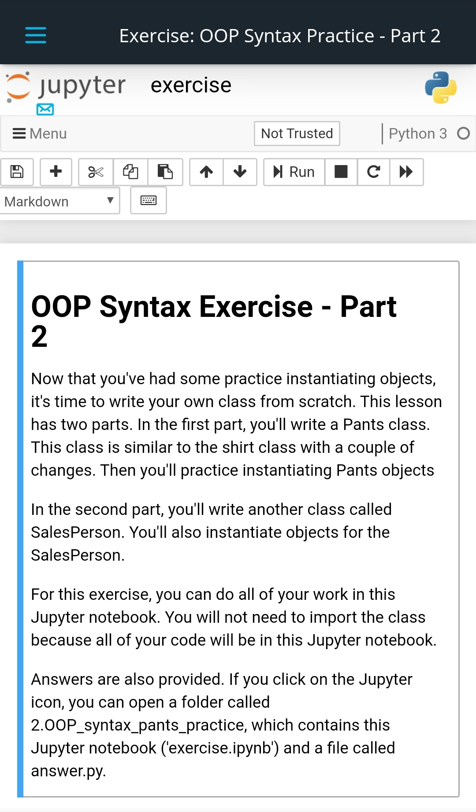

# 3-months-of-machine-learning-engineer

# My pledge "3 months of Udacity" for the Machine Learning Engineer nanodegree, the AWS DeepRacer scholarship I won.

## Day 1: November 19, 2019 #30DaysofUdacity #PracticeMakesPerfect

- I started the Machine Learning Engineer nanodegree.
- I read the **Syllabus: Machine Learning Engineer Nanodegree Program**.
- My current progress is:\
  **Part 1: Software Engineering Fundamentals** (Progress 22%)\
  **Lesson 2: Software Engineering Practices Pt I** (Progress 48%)\
  **12. Solution: Optimizing - Common Books**
- I encourage @KhushkumarP, @Jacqueline SusanM, @labibaR, @OudarjyaS, @MuhammadN, @Mohamed ChoukriB, @KonstantinosK, @AdityaK, @MahmmoudM, @LauraT, @ElenaK, @HelenaB, @RobO, @ShafaqA, @Nancy A, @TzuhsinC, @TemitopeO, @AarthiA, @NabhanA, @MD BAPPIP, @AnkitV, @fuzhanR, @Laszlo TothL. 

## Day 2: November 20, 2019 #30DaysofUdacity #PracticeMakesPerfect

- I'm watching the video lectures and programming the Jupyter notebooks.
- My current progress is:\
  **Part 1: Software Engineering Fundamentals** (Progress 48%)\
  **Lesson 3: Software Engineering Practices Pt II** (Progress 50%)\
  **7. Test Driven Development and Data Science**
- I encourage @KhushkumarP, @Jacqueline SusanM, @labibaR, @OudarjyaS, @MuhammadN, @Mohamed ChoukriB, @KonstantinosK, @AdityaK, @MahmmoudM, @LauraT, @ElenaK, @HelenaB, @RobO, @ShafaqA, @Nancy A, @TzuhsinC, @TemitopeO, @AarthiA, @NabhanA, @MD BAPPIP, @AnkitV, @fuzhanR, @Laszlo TothL. 

## Day 3: November 21, 2019 #30DaysofUdacity #PracticeMakesPerfect

- I'm watching the video lectures and programming the Jupyter notebooks.
- My current progress is:\
  **Part 1: Software Engineering Fundamentals** (Progress 52%)\
  **Lesson 3: Software Engineering Practices Pt II** (Progress 71%)\
  **10. Quiz: Logging**
- I encourage @KhushkumarP, @Jacqueline SusanM, @labibaR, @OudarjyaS, @MuhammadN, @Mohamed ChoukriB, @KonstantinosK, @AdityaK, @MahmmoudM, @LauraT, @ElenaK, @HelenaB, @RobO, @ShafaqA, @Nancy A, @TzuhsinC, @TemitopeO, @AarthiA, @NabhanA, @MD BAPPIP, @AnkitV, @fuzhanR, @Laszlo TothL. 

## Day 4: November 22, 2019 #30DaysofUdacity #PracticeMakesPerfect

- I'm watching the video lectures and programming the Jupyter notebooks.
- My current progress is:\
  **Part 1: Software Engineering Fundamentals** (Progress 55%)\
  **Lesson 3: Software Engineering Practices Pt II** (Progress 86%)\
  **12. Questions to Ask Yourself When Conducting a Code Review**
- I encourage @KhushkumarP, @Jacqueline SusanM, @labibaR, @OudarjyaS, @MuhammadN, @Mohamed ChoukriB, @KonstantinosK, @AdityaK, @MahmmoudM, @LauraT, @ElenaK, @HelenaB, @RobO, @ShafaqA, @Nancy A, @TzuhsinC, @TemitopeO, @AarthiA, @NabhanA, @MD BAPPIP, @AnkitV, @fuzhanR, @Laszlo TothL. 

## Day 5: November 23, 2019 #30DaysofUdacity #PracticeMakesPerfect

- I'm watching the video lectures and programming the Jupyter notebooks.
- I finished the following section:\
  **Part 1: Software Engineering Fundamentals**\
  **Lesson 3: Software Engineering Practices Pt II**
- I encourage @KhushkumarP, @Jacqueline SusanM, @labibaR, @OudarjyaS, @MuhammadN, @Mohamed ChoukriB, @KonstantinosK, @AdityaK, @MahmmoudM, @LauraT, @ElenaK, @HelenaB, @RobO, @ShafaqA, @Nancy A, @TzuhsinC, @TemitopeO, @AarthiA, @NabhanA, @MD BAPPIP, @AnkitV, @fuzhanR, @Laszlo TothL. 

## Day 6: November 24, 2019 #30DaysofUdacity #PracticeMakesPerfect

- I'm watching the video lectures and programming the Jupyter notebooks.
- My current progress is:\
  **Part 1: Software Engineering Fundamentals** (Progress 63%)\
  **Lesson 4: Introduction to Object-Oriented Programming** (Progress 14%)\
  **4. OOP Syntax**
- I encourage @KhushkumarP, @Jacqueline SusanM, @labibaR, @OudarjyaS, @MuhammadN, @Mohamed ChoukriB, @KonstantinosK, @AdityaK, @MahmmoudM, @LauraT, @ElenaK, @HelenaB, @RobO, @ShafaqA, @Nancy A, @TzuhsinC, @TemitopeO, @AarthiA, @NabhanA, @MD BAPPIP, @AnkitV, @fuzhanR, @Laszlo TothL. 

## Day 7: November 25, 2019 #30DaysofUdacity #PracticeMakesPerfect

- I'm watching the video lectures and programming the Jupyter notebooks.
- My current lecture is:\
  **Part 1: Software Engineering Fundamentals**\
  **Lesson 4: Introduction to Object-Oriented Programming**\
  **5. Exercise: OOP Syntax Practice - Part 1**
- I encourage @KhushkumarP, @Jacqueline SusanM, @labibaR, @OudarjyaS, @MuhammadN, @Mohamed ChoukriB, @KonstantinosK, @AdityaK, @MahmmoudM, @LauraT, @ElenaK, @HelenaB, @RobO, @ShafaqA, @Nancy A, @TzuhsinC, @TemitopeO, @AarthiA, @NabhanA, @MD BAPPIP, @AnkitV, @fuzhanR, @Laszlo TothL. 

## Day 8: November 26, 2019 #30DaysofUdacity #PracticeMakesPerfect

- I'm watching the video lectures and programming the Jupyter notebooks.
- My current lecture is:\
  **Part 1: Software Engineering Fundamentals**\
  **Lesson 4: Introduction to Object-Oriented Programming**\
  **6. A Couple of Notes about OOP**
- I encourage @KhushkumarP, @Jacqueline SusanM, @labibaR, @OudarjyaS, @MuhammadN, @Mohamed ChoukriB, @KonstantinosK, @AdityaK, @MahmmoudM, @LauraT, @ElenaK, @HelenaB, @RobO, @ShafaqA, @Nancy A, @TzuhsinC, @TemitopeO, @AarthiA, @NabhanA, @MD BAPPIP, @AnkitV, @fuzhanR, @Laszlo TothL. 

## Day 9: November 27, 2019 #30DaysofUdacity #PracticeMakesPerfect

- I'm watching the video lectures and programming the Jupyter notebooks.
- My current lecture is:\
  **Part 1: Software Engineering Fundamentals**\
  **Lesson 4: Introduction to Object-Oriented Programming**\
  **7. Exercise: OOP Syntax Practice - Part 2**
- I encourage @KhushkumarP, @Jacqueline SusanM, @labibaR, @OudarjyaS, @MuhammadN, @Mohamed ChoukriB, @KonstantinosK, @AdityaK, @MahmmoudM, @LauraT, @ElenaK, @HelenaB, @RobO, @ShafaqA, @Nancy A, @TzuhsinC, @TemitopeO, @AarthiA, @NabhanA, @MD BAPPIP, @AnkitV, @fuzhanR, @Laszlo TothL. 

## Day 10: November 28, 2019 #30DaysofUdacity #PracticeMakesPerfect

- I'm watching the video lectures and programming the Jupyter notebooks.
- My current lecture is:\
  **Part 1: Software Engineering Fundamentals**\
  **Lesson 4: Introduction to Object-Oriented Programming**\
  **8. Commenting Object-Oriented Code**
- I encourage @KhushkumarP, @Jacqueline SusanM, @labibaR, @OudarjyaS, @MuhammadN, @Mohamed ChoukriB, @KonstantinosK, @AdityaK, @MahmmoudM, @LauraT, @ElenaK, @HelenaB, @RobO, @ShafaqA, @Nancy A, @TzuhsinC, @TemitopeO, @AarthiA, @NabhanA, @MD BAPPIP, @AnkitV, @fuzhanR, @Laszlo TothL. 

## Day 11: November 29, 2019 #30DaysofUdacity #PracticeMakesPerfect

- I'm watching the video lectures and programming the Jupyter notebooks.
- My current lecture is:\
  **Part 1: Software Engineering Fundamentals**\
  **Lesson 4: Introduction to Object-Oriented Programming**\
  **9. A Gaussian Class**
- I encourage @KhushkumarP, @Jacqueline SusanM, @labibaR, @OudarjyaS, @MuhammadN, @Mohamed ChoukriB, @KonstantinosK, @AdityaK, @MahmmoudM, @LauraT, @ElenaK, @HelenaB, @RobO, @ShafaqA, @Nancy A, @TzuhsinC, @TemitopeO, @AarthiA, @NabhanA, @MD BAPPIP, @AnkitV, @fuzhanR, @Laszlo TothL. 

## Day 12: November 30, 2019 #30DaysofUdacity #PracticeMakesPerfect

- I'm watching the video lectures and programming the Jupyter notebooks.
- My current lecture is:\
  **Part 1: Software Engineering Fundamentals**\
  **Lesson 4: Introduction to Object-Oriented Programming**\
  **10. How the Gaussian Class Works**
- I encourage @KhushkumarP, @Jacqueline SusanM, @labibaR, @OudarjyaS, @MuhammadN, @Mohamed ChoukriB, @KonstantinosK, @AdityaK, @MahmmoudM, @LauraT, @ElenaK, @HelenaB, @RobO, @ShafaqA, @Nancy A, @TzuhsinC, @TemitopeO, @AarthiA, @NabhanA, @MD BAPPIP, @AnkitV, @fuzhanR, @Laszlo TothL. 

## Day 13: December 1, 2019 #30DaysofUdacity #PracticeMakesPerfect

- I'm watching the video lectures and programming the Jupyter notebooks.
- My current lecture is:\
  **Part 1: Software Engineering Fundamentals**\
  **Lesson 4: Introduction to Object-Oriented Programming**\
  **11. Exercise: Code the Gaussian Class**
- I encourage @KhushkumarP, @Jacqueline SusanM, @labibaR, @OudarjyaS, @MuhammadN, @Mohamed ChoukriB, @KonstantinosK, @AdityaK, @MahmmoudM, @LauraT, @ElenaK, @HelenaB, @RobO, @ShafaqA, @Nancy A, @TzuhsinC, @TemitopeO, @AarthiA, @NabhanA, @MD BAPPIP, @AnkitV, @fuzhanR, @Laszlo TothL. 

## Day 14: December 2, 2019 #30DaysofUdacity #PracticeMakesPerfect

- I'm watching the video lectures and programming the Jupyter notebooks.
- My current lecture is:\
  **Part 1: Software Engineering Fundamentals**\
  **Lesson 4: Introduction to Object-Oriented Programming**\
  **12. Magic Methods**
- I encourage @KhushkumarP, @Jacqueline SusanM, @labibaR, @OudarjyaS, @MuhammadN, @Mohamed ChoukriB, @KonstantinosK, @AdityaK, @MahmmoudM, @LauraT, @ElenaK, @HelenaB, @RobO, @ShafaqA, @Nancy A, @TzuhsinC, @TemitopeO, @AarthiA, @NabhanA, @MD BAPPIP, @AnkitV, @fuzhanR, @Laszlo TothL. 

## Day 15: December 3, 2019 #30DaysofUdacity #PracticeMakesPerfect

- I'm watching the video lectures and programming the Jupyter notebooks.
- My current lecture is:\
  **Part 1: Software Engineering Fundamentals**\
  **Lesson 4: Introduction to Object-Oriented Programming**\
  **13. Exercise: Code Magic Methods**
- I encourage @KhushkumarP, @Jacqueline SusanM, @labibaR, @OudarjyaS, @MuhammadN, @Mohamed ChoukriB, @KonstantinosK, @AdityaK, @MahmmoudM, @LauraT, @ElenaK, @HelenaB, @RobO, @ShafaqA, @Nancy A, @TzuhsinC, @TemitopeO, @AarthiA, @NabhanA, @MD BAPPIP, @AnkitV, @fuzhanR, @Laszlo TothL. 

## Day 16: December 4, 2019 #30DaysofUdacity #PracticeMakesPerfect

- I'm watching the video lectures and programming the Jupyter notebooks.
- My current lecture is:\
  **Part 1: Software Engineering Fundamentals**\
  **Lesson 4: Introduction to Object-Oriented Programming**\
  **14. Inheritance**
- I encourage @KhushkumarP, @Jacqueline SusanM, @labibaR, @OudarjyaS, @MuhammadN, @Mohamed ChoukriB, @KonstantinosK, @AdityaK, @MahmmoudM, @LauraT, @ElenaK, @HelenaB, @RobO, @ShafaqA, @Nancy A, @TzuhsinC, @TemitopeO, @AarthiA, @NabhanA, @MD BAPPIP, @AnkitV, @fuzhanR, @Laszlo TothL. 

## Day 17: December 5, 2019 #30DaysofUdacity #PracticeMakesPerfect

- I'm watching the video lectures and programming the Jupyter notebooks.
- My current lecture is:\
  **Part 1: Software Engineering Fundamentals**\
  **Lesson 4: Introduction to Object-Oriented Programming**\
  **15. Exercise: Inheritance with Clothing**
- I encourage @KhushkumarP, @Jacqueline SusanM, @labibaR, @OudarjyaS, @MuhammadN, @Mohamed ChoukriB, @KonstantinosK, @AdityaK, @MahmmoudM, @LauraT, @ElenaK, @HelenaB, @RobO, @ShafaqA, @Nancy A, @TzuhsinC, @TemitopeO, @AarthiA, @NabhanA, @MD BAPPIP, @AnkitV, @fuzhanR, @Laszlo TothL. 

## Day 18: December 6, 2019 #30DaysofUdacity #PracticeMakesPerfect

- I'm watching the video lectures and programming the Jupyter notebooks.
- My current lecture is:\
  **Part 1: Software Engineering Fundamentals**\
  **Lesson 4: Introduction to Object-Oriented Programming**\
  **16. Inheritance: Probability Distribution**
- I encourage @KhushkumarP, @Jacqueline SusanM, @labibaR, @OudarjyaS, @MuhammadN, @Mohamed ChoukriB, @KonstantinosK, @AdityaK, @MahmmoudM, @LauraT, @ElenaK, @HelenaB, @RobO, @ShafaqA, @Nancy A, @TzuhsinC, @TemitopeO, @AarthiA, @NabhanA, @MD BAPPIP, @AnkitV, @fuzhanR, @Laszlo TothL. 

## Day 19: December 7, 2019 #30DaysofUdacity #PracticeMakesPerfect

- I'm watching the video lectures and programming the Jupyter notebooks.
- My current lecture is:\
  **Part 1: Software Engineering Fundamentals**\
  **Lesson 4: Introduction to Object-Oriented Programming**\
  **17. Demo: Inheritance Probability Distributions**
- I encourage @KhushkumarP, @Jacqueline SusanM, @labibaR, @OudarjyaS, @MuhammadN, @Mohamed ChoukriB, @KonstantinosK, @AdityaK, @MahmmoudM, @LauraT, @ElenaK, @HelenaB, @RobO, @ShafaqA, @Nancy A, @TzuhsinC, @TemitopeO, @AarthiA, @NabhanA, @MD BAPPIP, @AnkitV, @fuzhanR, @Laszlo TothL. 

## Day 20: December 8, 2019 #30DaysofUdacity #PracticeMakesPerfect #FinalDaysof2019

- I'm watching the video lectures and programming the Jupyter notebooks.
- My current lecture is:\
  **Part 1: Software Engineering Fundamentals**\
  **Lesson 4: Introduction to Object-Oriented Programming**\
  **18. Advanced OOP Topics**
- I encourage @KhushkumarP, @Jacqueline SusanM, @labibaR, @OudarjyaS, @MuhammadN, @Mohamed ChoukriB, @KonstantinosK, @AdityaK, @MahmmoudM, @LauraT, @ElenaK, @HelenaB, @RobO, @ShafaqA, @Nancy A, @TzuhsinC, @TemitopeO, @AarthiA, @NabhanA, @MD BAPPIP, @AnkitV, @fuzhanR, @Laszlo TothL. 

## Day 21: December 9, 2019 #30DaysofUdacity #PracticeMakesPerfect #FinalDaysof2019

- I'm watching the video lectures and programming the Jupyter notebooks.
- My current lecture is:\
  **Part 1: Software Engineering Fundamentals**\
  **Lesson 4: Introduction to Object-Oriented Programming**\
  **19. Organizing into Modules**
- I encourage @KhushkumarP, @Jacqueline SusanM, @labibaR, @OudarjyaS, @MuhammadN, @Mohamed ChoukriB, @KonstantinosK, @AdityaK, @MahmmoudM, @LauraT, @ElenaK, @HelenaB, @RobO, @ShafaqA, @Nancy A, @TzuhsinC, @TemitopeO, @AarthiA, @NabhanA, @MD BAPPIP, @AnkitV, @fuzhanR, @Laszlo TothL. 

## Day 22: December 10, 2019 #30DaysofUdacity #PracticeMakesPerfect #FinalDaysof2019

- I'm watching the video lectures and programming the Jupyter notebooks.
- My current lecture is:\
  **Part 1: Software Engineering Fundamentals**\
  **Lesson 4: Introduction to Object-Oriented Programming**\
  **20. Demo: Modularized Code**
- I encourage @KhushkumarP, @Jacqueline SusanM, @labibaR, @OudarjyaS, @MuhammadN, @Mohamed ChoukriB, @KonstantinosK, @AdityaK, @MahmmoudM, @LauraT, @ElenaK, @HelenaB, @RobO, @ShafaqA, @Nancy A, @TzuhsinC, @TemitopeO, @AarthiA, @NabhanA, @MD BAPPIP, @AnkitV, @fuzhanR, @Laszlo TothL. 

## Day 23: December 11, 2019 #30DaysofUdacity #PracticeMakesPerfect #FinalDaysof2019

- I correctly generated the color features of the Traffic Light Classifier in the Intro to Self-Driving Cars nanodegree. I'm doing the certification to review this AI project.
- I'm watching the video lectures and programming the Jupyter notebooks.
- My current lecture is:\
  **Part 1: Software Engineering Fundamentals**\
  **Lesson 4: Introduction to Object-Oriented Programming**\
  **21. Making a Package**
- I encourage @KhushkumarP, @Jacqueline SusanM, @labibaR, @OudarjyaS, @MuhammadN, @Mohamed ChoukriB, @KonstantinosK, @AdityaK, @MahmmoudM, @LauraT, @ElenaK, @HelenaB, @RobO, @ShafaqA, @Nancy A, @TzuhsinC, @TemitopeO, @AarthiA, @NabhanA, @MD BAPPIP, @AnkitV, @fuzhanR, @Laszlo TothL. 

## Day 24: December 12, 2019 #30DaysofUdacity #PracticeMakesPerfect #FinalDaysof2019

- I obtained my certification to review the Traffic Light Classifier of the Intro to Self-Driving Cars nanodegree. See the photo.
- I'm watching the video lectures and programming the Jupyter notebooks.
- My current lecture is:\
  **Part 1: Software Engineering Fundamentals**\
  **Lesson 4: Introduction to Object-Oriented Programming**\
  **22. Virtual Environments**
- I encourage @KhushkumarP, @Jacqueline SusanM, @labibaR, @OudarjyaS, @MuhammadN, @Mohamed ChoukriB, @KonstantinosK, @AdityaK, @MahmmoudM, @LauraT, @ElenaK, @HelenaB, @RobO, @ShafaqA, @Nancy A, @TzuhsinC, @TemitopeO, @AarthiA, @NabhanA, @MD BAPPIP, @AnkitV, @fuzhanR, @Laszlo TothL. 

## Day 25: December 13, 2019 #30DaysofUdacity #PracticeMakesPerfect #FinalDaysof2019

- Intel and Udacity gave me a scholarship to learn state-of-the-art algorithms of artificial intelligence, computer vision, and the Internet of Things (IoT) #UdacityIntelTechScholars
- I'm watching the video lectures and programming the Jupyter notebooks.
- My current lecture is:\
  **Part 1: Software Engineering Fundamentals**\
  **Lesson 4: Introduction to Object-Oriented Programming**\
  **23. Exercise: Making a Package and Pip Installing**
- I encourage @KhushkumarP, @Jacqueline SusanM, @labibaR, @OudarjyaS, @MuhammadN, @Mohamed ChoukriB, @KonstantinosK, @AdityaK, @MahmmoudM, @LauraT, @ElenaK, @HelenaB, @RobO, @ShafaqA, @Nancy A, @TzuhsinC, @TemitopeO, @AarthiA, @NabhanA, @MD BAPPIP, @AnkitV, @fuzhanR, @Laszlo TothL. 

## Day 26: December 14, 2019 #30DaysofUdacity #PracticeMakesPerfect #FinalDaysof2019

- I'm watching the video lectures and programming the Jupyter notebooks.
- My current lecture is:\
  **Part 1: Software Engineering Fundamentals**\
  **Lesson 4: Introduction to Object-Oriented Programming**\
  **24. Binomial Class**
- I encourage @KhushkumarP, @Jacqueline SusanM, @labibaR, @OudarjyaS, @MuhammadN, @Mohamed ChoukriB, @KonstantinosK, @AdityaK, @MahmmoudM, @LauraT, @ElenaK, @HelenaB, @RobO, @ShafaqA, @Nancy A, @TzuhsinC, @TemitopeO, @AarthiA, @NabhanA, @MD BAPPIP, @AnkitV, @fuzhanR, @Laszlo TothL. 

## Day 27: December 15, 2019 #30DaysofUdacity #PracticeMakesPerfect #FinalDaysof2019

- I just applied to the Ph.D. in Machine Learning.
- I'm watching the video lectures and programming the Jupyter notebooks.
- My current lecture is:\
  **Part 1: Software Engineering Fundamentals**\
  **Lesson 4: Introduction to Object-Oriented Programming**\
  **25. Exercise: Binomial Class**
- I encourage @KhushkumarP, @Jacqueline SusanM, @labibaR, @OudarjyaS, @MuhammadN, @Mohamed ChoukriB, @KonstantinosK, @AdityaK, @MahmmoudM, @LauraT, @ElenaK, @HelenaB, @RobO, @ShafaqA, @Nancy A, @TzuhsinC, @TemitopeO, @AarthiA, @NabhanA, @MD BAPPIP, @AnkitV, @fuzhanR, @Laszlo TothL. 

